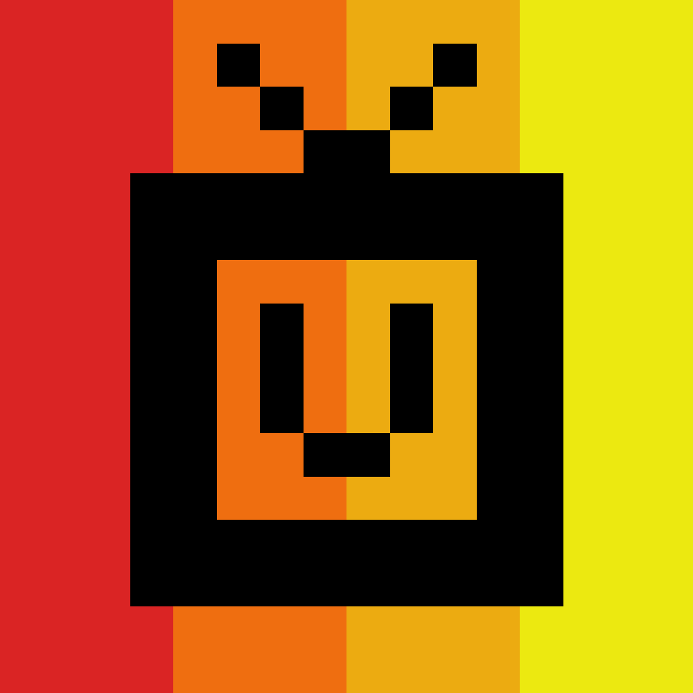

 
  

<h1 align="center">SpawnBot</h1>

SpawnBot is a simple IRC<->Discord bridge bot built for [the spawn](https://thespawn.net) gaming community.

<b>NOTE: Not intended for public use. This is a small project designed for our own specific use case, and is not set up for public use.</b>

Made with :heart: by <a href="https://github.com/alefnull" target="_blank">alefnull</a>

## Configuration

SpawnBot is configured using environment variables:

*   `SPAWNBOT_IRC_SERVER`: The IRC server address (e.g., `irc.quakenet.org`). (Required)
*   `SPAWNBOT_IRC_PORT`: The IRC server port. (Default: `6667`)
*   `SPAWNBOT_IRC_NICK`: The nick the bot will use on IRC. (Default: `SpawnBot`)
*   `SPAWNBOT_IRC_USER`: The username the bot will use on IRC. (Default: `spawnbot`)
*   `SPAWNBOT_IRC_NAME`: The real name the bot will use on IRC. (Default: `SpawnBot Go IRC Bot`)
*   `SPAWNBOT_QNET_AUTH`: The password for authenticating with QuakeNet's Q service. Also supports `QNET_AUTH` for backward compatibility. (Required)
*   `SPAWNBOT_DISCORD_TOKEN`: The Discord bot token. Also supports `SPAWNBOT_TOKEN` for backward compatibility. (Required)
*   `SPAWNBOT_DISCORD_CHANNEL_ID`: The ID of the Discord channel to bridge. (Required)
*   `SPAWNBOT_IRC_CHANNEL`: The IRC channel to bridge (e.g., `#yourchannel`). (Required)

## License ##

This project is under license from MIT. For more details, see the [LICENSE](LICENSE) file.

